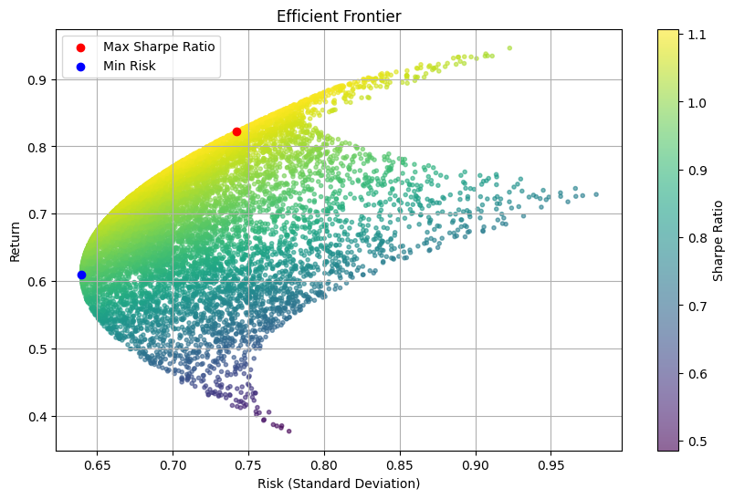

1. Portfolio Optimization Tool
What to Build: Create a Python-based tool that uses optimization algorithms (e.g., Markowitz mean-variance optimization) to construct efficient investment portfolios.
Key Features:
Integration with financial APIs (like Yahoo Finance) for real-time data.
Sharpe ratio and risk-return analysis.
Visualization of efficient frontiers.
Skills Highlighted: Python, data analysis, financial modeling, and optimization techniques.

Notes:
- according to efficient frontier graph below, where it tries to find the optimized portfolio on 3 assets, you will see the best returns if you either minimize risk or maximize risk. Any average risk of 0.77 shows the most variance among returns.
