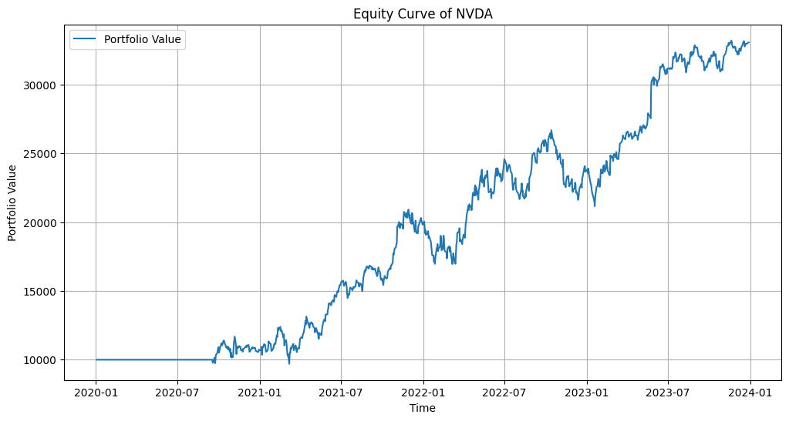

2. Algorithmic Trading Strategy
What to Build: Develop a backtesting platform for algorithmic trading strategies.
Key Features:
Implement strategies such as moving average crossovers or momentum-based trading.
Analyze performance metrics like CAGR, volatility, and drawdowns.
Skills Highlighted: Python, pandas, NumPy, algorithmic trading, and quantitative analysis.

Notes:
Simple trading strategy based on SMA crossing
- can add support for other indicators such as MACD and RSI
- Ichimoku cloud can be a good indicator source

- Best strategy is a to buy when a short 

On Stocks:
- NVDA has had a strong upward trend for the past 3 years so equity curve has a strong upward trend (180 day SMA and 50 day SMA)

